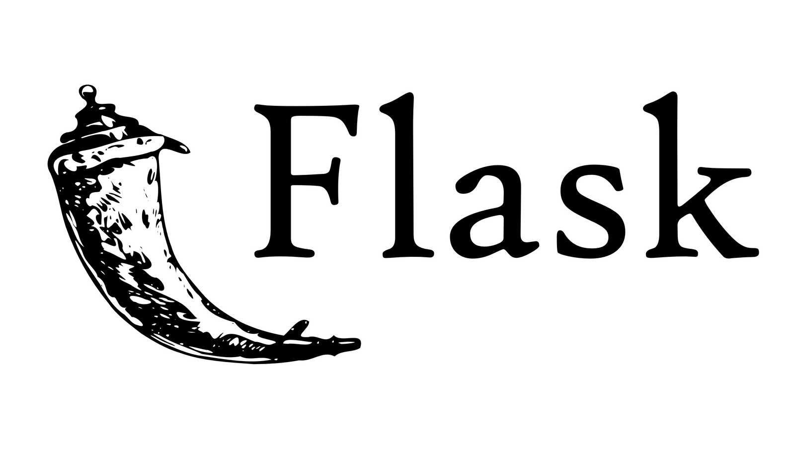

# [Flask-Starter](#)

**Flask-starter** is a simple starter for your flask project that implement some boiler plate code for you so as you could focus on the core functionality of your project.



## Features to Implemented

- [x] Flask-Blueprint
- [ ] Flask-SQLAlchemy
- [ ] Flask-Migrate
- [ ] Flask-Login
- [ ] Flask-MarshMallow

## How to run

```bash
git clone ...
cd project-name
project-name-> export FLASK_APP = app.py 
project-name-> flask run 
```

## Contributions

This is an open source project therefore I welcome all contributors to adding and modifying the starter to make it more friendly and elegant. Just Fork it !!

## Credits

All the credits to [Kalebu](https://github.com/kalebu) and other future contributors
